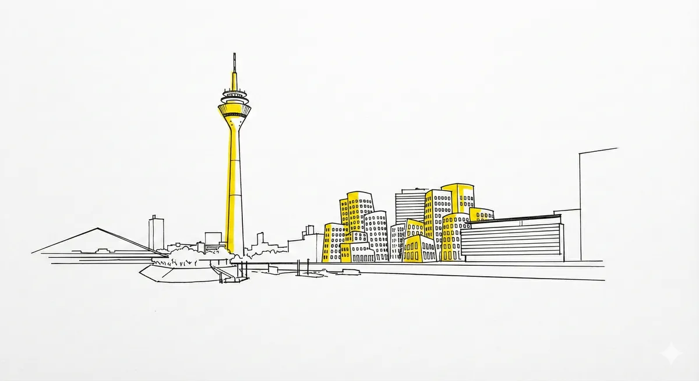
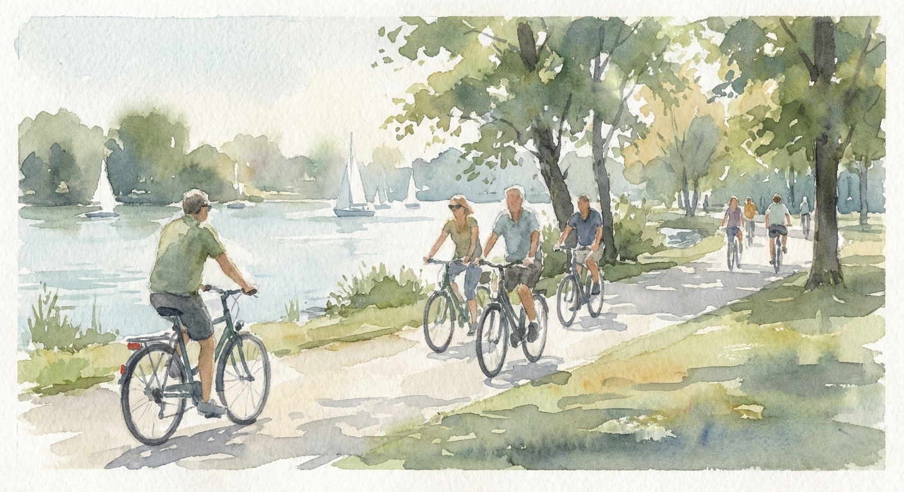
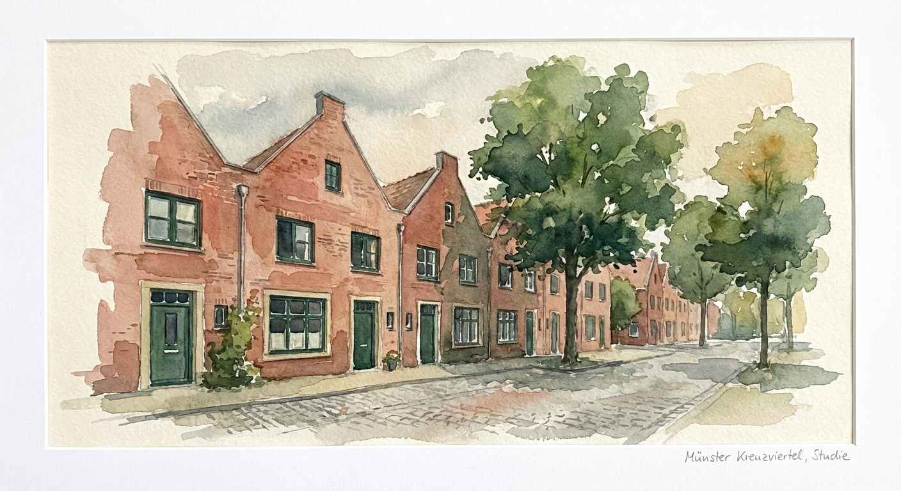
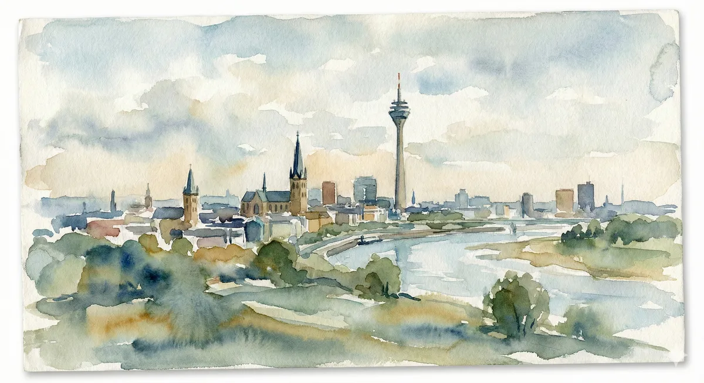
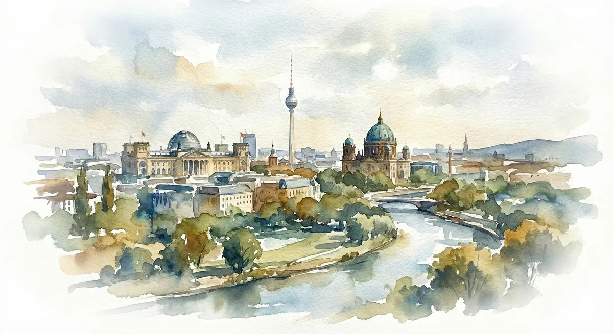

Programmatic SEO hat einen schlechten Ruf. Meistens zu Recht.

Wir kennen alle diese lieblosen "Landingpage-Wüsten": Hunderte Unterseiten, auf denen nur der Stadtname ausgetauscht wurde. "Haus kaufen in A", "Haus kaufen in B". Gleicher Text, gleiche langweiligen Stockfotos.

Für mein Projekt [maklerupdate.de](https://maklerupdate.de) (Immobilien-Alerts im Segment >800k) war das keine Option. Meine Zielgruppe sucht Villen in Münster oder Meerbusch – die erwarten Exklusivität, keinen Spam.

Als Solo-Developer stand ich vor der Herausforderung: Wie skaliere ich hyper-lokalen Content für 50+ Regionen, der sich handgemacht und hochwertig anfühlt, aber vollautomatisiert läuft?

Die Lösung ist eine Pipeline, die ich "Nano Banana" getauft habe. Sie basiert auf spezialisierten AI-Agents, die nicht nur Text generieren, sondern eine komplette visuelle Identität schaffen.

Hier ist der "Under the Hood" Blick in meine Architektur.

## 1. Die Basis: Fakten statt Halluzinationen

Der erste Schritt ist der **Researcher Agent**. Sein Job ist nicht Kreativität, sondern Präzision. Ich nutze keine LLMs, um Marktpreise zu "raten". Der Agent nutzt Browsing-Tools, um echte Daten für 2024/2025 zu finden.

Der entscheidende Trick ist der System-Prompt mit Constraints:

```markdown
Role: Senior Real Estate Analyst
Task: Research region "{REGION}". Output strictly valid JSON.

Constraint 1: Find recent market data (Buy/Rent prices 2024).
Constraint 2: Identify specific neighborhoods with distinct vibes
(e.g., "Family Friendly" vs. "Urban").
Constraint 3: Identify ONE iconic architectural landmark suitable for a painting.
```

Das Ergebnis ist ein JSON-Objekt, das durch ein Zod-Schema (TypeScript) validiert wird. Wenn die Datenstruktur nicht stimmt, geht nichts live. So garantiere ich, dass ich echte Fakten über den "Aasee in Münster" habe, bevor ich auch nur ein Wort Text generiere.

## 2. Die Varianz: Warum Meerbusch nicht München ist

Um "Duplicate Content" Penalties von Google zu vermeiden, reicht es nicht, Wörter zu tauschen. Die Struktur muss atmen.

Mein System nutzt die recherchierten Fakten, um dynamische Sektionen zu bauen:

- In **Münster** generiert das System eine Sektion über "Fahrrad-Infrastruktur und studentisches Flair".
- In **Düsseldorf-Oberkassel** wird daraus eine Sektion über "Rheinnähe und Expat-Community".

Der Aufbau der Seite (Hero → Market Stats → Neighborhoods → Insider Fact) passt sich den Daten an, nicht umgekehrt.

## 3. Die Visuals: Konsistenz durch den "Aquarell-Algorithmus"

Das Herzstück von Nano Banana ist der **Artist Agent**. Ich wollte weg vom sterilen Tech-Look und hin zu etwas Emotionalem, das zum Thema "Wohnen" passt. Die Wahl fiel auf einen hochwertigen Aquarell-Stil.

Die Herausforderung bei AI-Bildern ist Konsistenz. Wenn man 50 Bilder generiert, hat man oft 50 verschiedene Stile. Meine Lösung ist ein striktes Prompt-Template, das Variablen und Konstanten mischt:

**Der Prompt-Aufbau:**

```
A wide-angle landscape aquarelle painting of {LANDMARK}.
Soft watercolor bleed, loose brushwork, warm golden light,
{VIBE_DETAILS}, dreamy atmosphere, textured paper grain,
white background.
```

**Das Ergebnis am Beispiel Münster:** Ich habe das System für das Münsterland getestet. Der Agent generierte drei Bilder:

**Hero: Prinzipalmarkt**

```
A wide-angle landscape aquarelle painting style, soft watercolor bleed,
loose brushwork of the historic Prinzipalmarkt gabled houses and
St. Lamberti church spire in Münster at sunset. Warm golden hour light
casting long shadows, dreamy atmosphere, visible textured paper grain,
muted palette of warm ochres, soft blues and earthy reds,
white background border.
```


**Detail 1: Aasee (Lifestyle)**

```
An impressionistic scene aquarelle painting style, soft watercolor bleed,
loose brushwork of people leisure cycling along the paths of the Aasee lake
in Münster with sailboats in the distance. Dappled afternoon light,
relaxed atmosphere, visible textured paper grain, muted palette of
natural greens and soft lake blues, white background border.
```



**Detail 2: Kreuzviertel (Architektur)**

```
An architectural study aquarelle painting style, soft watercolor bleed,
loose brushwork of typical northern German red brick family homes
lined up on a leafy street in Münster Kreuzviertel. Soft daylight,
inviting atmosphere, visible textured paper grain, muted palette of
terracotta reds and deep greens, white background border.
```



Obwohl die Motive völlig unterschiedlich sind, wirken sie wie aus einem Guss. Die Farben, die Textur des "Papiers", der Pinselstrich – alles passt zusammen. Es wirkt nicht wie generiert, sondern wie von einem Illustrator für diese Stadt gezeichnet.

## 4. Ausblick: Flexibilität ist alles

Das Schöne an dieser Architektur ("Agents als Microservices") ist die Austauschbarkeit. Das System läuft aktuell perfekt im Aquarell-Modus. Aber wenn ich morgen entscheide, dass ich einen sterilen "Tech-Bauhaus"-Look (schwarze Tinte, gelbe Akzente) testen möchte, muss ich keine einzige Zeile Code im Backend ändern.

Ich tausche nur die Instruktion des Artist Agents aus – und über Nacht generiert das System 50 Regionen in einer komplett neuen Corporate Identity neu.

## Fazit

Automatisierung muss nicht seelenlos sein. Mit der richtigen Orchestrierung von AI-Agents können wir Webseiten bauen, die lokal relevant und visuell berührend sind – und trotzdem skalieren.

---

**Neugierig auf das Ergebnis?** Die neuen, vollautomatisierten Regionen-Seiten (inklusive der Münster-Aquarelle) werden in den nächsten Tagen auf [maklerupdate.de](https://maklerupdate.de) live gehen.

---

## Weitere Beispiele







